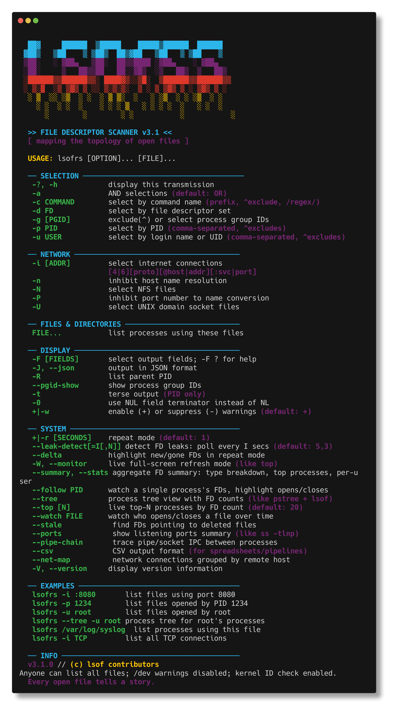

```
 ██▓      ██████  ▒█████    █████▒██████  ██████
▓██▒    ▒██    ▒ ▒██▒  ██▒▓██   ▒██   ▒ ▒██    ▒
▒██░    ░ ▓██▄   ▒██░  ██▒▒████ ░▓██▄    ░ ▓██▄
▒██░      ▒   ██▒▒██   ██░░▓█▒  ░▒   ██▒  ▒   ██▒
░██████▒▒██████▒▒░ ████▓▒░░▒█░  ▒██████▒▒██████▒▒
░ ▒░▓  ░▒ ▒▓▒ ▒ ░░ ▒░▒░▒░  ▒ ░ ▒ ▒▓▒ ▒ ░ ▒▓▒ ▒ ░
░ ░ ▒  ░░ ░▒  ░ ░  ░ ▒ ▒░  ░   ░ ░▒  ░ ░ ░▒  ░ ░
  ░ ░  ░ ░  ░    ░ ░ ░ ▒   ░ ░ ░ ░  ░   ░ ░  ░
    ░        ░        ░ ░           ░           ░
```

<p align="center">
  <a href="https://github.com/MenkeTechnologies/lsofrs/actions/workflows/ci.yml"></a>
  <a href="https://crates.io/crates/lsofrs"></a>
  <a href="https://crates.io/crates/lsofrs"></a>
  <a href="https://docs.rs/lsofrs"></a>
  <a href="https://github.com/MenkeTechnologies/lsofrs/blob/main/LICENSE"></a>
</p>

> *"Rewritten in Rust. Faster. Safer. The same cyberpunk soul."*

---

## // WHAT IS THIS

**lsofrs** — **L**ist **S**ystem **O**pen **F**iles in **R**u**s**t — v1.5.1

A Rust rewrite of [lsofng](https://github.com/MenkeTechnologies/lsofng), the modernized lsof diagnostic tool. Maps the invisible topology between processes and the files they hold open: regular files, directories, sockets, pipes, devices, kqueues — anything the kernel touches.

If a process has a file descriptor, `lsofrs` sees it.

---

## // SCREENSHOT



---


## // JACK IN — BUILD FROM SOURCE

```bash
cargo build --release
sudo cp target/release/lsofrs /usr/local/sbin/
```

Or install directly:

```bash
cargo install --path .
```

---

## // USAGE

```bash
lsofrs                           # list all open files
lsofrs -p 1234                   # files for PID 1234
lsofrs -c Chrome                 # files for Chrome processes
lsofrs -u root                   # files for root user
lsofrs -i                        # network connections only
lsofrs -i :8080                  # who's listening on port 8080
lsofrs /path/to/file             # who has this file open
lsofrs -t -c nginx               # just PIDs (for scripting)
```

### Network Filters

```bash
lsofrs -i                        # all network files
lsofrs -i 4                      # IPv4 only
lsofrs -i 6                      # IPv6 only
lsofrs -i TCP                    # TCP only
lsofrs -i :443                   # port 443
lsofrs -i TCP:443                # TCP port 443
```

### Output Formats

```bash
lsofrs                           # columnar (default, cyberpunk-themed on TTY)
lsofrs --json                    # JSON array output
lsofrs -J                        # JSON (short form)
lsofrs -F pcfn                   # field output (p=pid, c=cmd, f=fd, n=name)
lsofrs -t                        # terse (PIDs only)
```

### Selection Combinators

```bash
lsofrs -p 1234,5678              # multiple PIDs
lsofrs -u root,wizard            # multiple users
lsofrs -p ^1234                  # exclude PID 1234
lsofrs -u ^root                  # exclude root
lsofrs -a -p 1234 -i             # AND: PID 1234 AND network
lsofrs -d 0-10                   # FD range 0-10
lsofrs -c '/nginx|apache/'       # regex command match
```

---

## // ADVANCED MODES

### Top-N Dashboard (`--top`)

Live auto-refreshing dashboard of the top processes sorted by FD count. Like `iotop` for file descriptors — shows FD type distribution bars, delta tracking, and per-process breakdowns.

```bash
lsofrs --top                     # top 20 processes by FD count
lsofrs --top 10                  # top 10 only
lsofrs --top -r 5                # refresh every 5 seconds
lsofrs --top -u root             # top FD consumers for root
```

**Controls**:

| Key | Action |
|-----|--------|
| `s` | Cycle sort column (FDs→PID→USER→REG→SOCK→PIPE→OTHER→DELTA→CMD) |
| `r` | Reverse sort order |
| `+`/`-` | Show more/fewer processes (±5) |
| `1`-`9` | Set refresh interval (seconds) |
| `<`/`>` | Fine-adjust refresh interval (±1s) |
| `p` | Pause/resume data collection |
| `b` | Toggle distribution bar column |
| `d` | Toggle delta column |
| `?`/`h` | Toggle help overlay |
| `q`/`Esc`/`Ctrl-C` | Quit |

### File Watch (`--watch FILE`)

Monitor who opens and closes a specific file over time. Prints timestamped `+OPEN`/`-CLOSE` events as they happen — like a lightweight `inotifywait` / `fs_usage` for a single path.

```bash
lsofrs --watch /var/log/syslog          # watch syslog
lsofrs --watch /tmp/myapp.sock          # watch a socket file
lsofrs --watch /dev/null -r 2           # poll every 2 seconds
```

Each event shows timestamp, open/close tag, PID, user, FD, and command. When piped, prints a single snapshot and exits.

### Process Tree (`--tree`)

Hierarchical process tree view with FD counts, type breakdowns, and network connection counts. Like `pstree` meets `lsof`.

```bash
lsofrs --tree                    # full process tree with FD stats
lsofrs --tree -u root            # tree for root's processes
lsofrs --tree -c Chrome          # tree for Chrome and helpers
lsofrs --tree --json             # JSON tree with nested children
```

Each node shows: PID, user, FD count, command name, type breakdown (`[REG:12 IPv4:3 PIPE:2]`), and network connection count. Notable files (sockets, pipes) are listed inline under each process.

### Live Monitor (`--monitor` / `-W`)

Full-screen alternate-buffer display like `top(1)`. Auto-refreshes with interactive controls.

```bash
lsofrs --monitor                 # full-screen monitor
lsofrs -W -r 2                   # refresh every 2 seconds
lsofrs -W -c Chrome              # monitor Chrome only
```

**Controls**: `s`=sort, `r`=reverse, `f`=filter, `p`=pause, `?`=help, `q`=quit

### Follow Mode (`--follow PID`)

Watch a single process's FDs in real-time. New opens highlighted `+NEW` in green, closes `-DEL` in red.

```bash
lsofrs --follow 1234             # watch PID 1234
lsofrs --follow 1234 -r 2        # 2-second refresh
```

### FD Leak Detection (`--leak-detect`)

Monitors per-process FD counts over time. Flags processes with monotonically increasing FD counts.

```bash
lsofrs --leak-detect             # default: 5s interval, 3 increase threshold
lsofrs --leak-detect=10,5        # 10s interval, flag after 5 consecutive increases
lsofrs --leak-detect -u wizard   # monitor only wizard's processes
```

### Summary / Statistics (`--summary`)

Aggregate FD breakdown with bar charts, top processes, per-user totals.

```bash
lsofrs --summary                 # text report
lsofrs --summary --json          # JSON report
lsofrs --summary -i              # network-only summary
```

### Delta Highlighting (`--delta`)

Color-code changes between repeat iterations. New FDs in green, gone in red.

```bash
lsofrs --delta -r 2              # repeat every 2s with change highlighting
lsofrs --delta -r 1 -c myapp     # watch myapp changes
```

---

## // CYBERPUNK THEME

When output goes to a TTY, lsofrs activates cyberpunk-themed column headers and ANSI coloring:

| Piped | TTY |
|-------|-----|
| COMMAND | PROCESS |
| PID | PRC |
| USER | H4XOR |
| TYPE | CL4SS |
| DEVICE | DEV/ICE |
| SIZE/OFF | BYT3/0FF |
| NODE | N0DE |
| NAME | T4RGET |

When piped or redirected, plain headers and no colors are used — safe for scripts.

---

## // ARCHITECTURE

```
src/
├── main.rs      # CLI entry point, dispatch, repeat/leak-detect loops
├── cli.rs       # clap argument definitions + custom help display
├── types.rs     # Core data structures (Process, OpenFile, SocketInfo, etc.)
├── darwin.rs    # macOS libproc FFI — process/FD enumeration
├── filter.rs    # Selection & filtering (PID, user, command, FD, network)
├── output.rs    # Columnar & field output formatting, ANSI theming
├── json.rs      # JSON serialization via serde
├── monitor.rs   # Live full-screen mode (crossterm alternate screen)
├── follow.rs    # Single-process FD tracking with status transitions
├── leak.rs      # Circular-buffer leak detector
├── delta.rs     # Iteration-diff engine for change highlighting
├── summary.rs   # Aggregate statistics with bar charts
├── tree.rs      # Process tree view with FD inheritance
├── top.rs       # Live top-N FD dashboard with delta tracking
└── watch.rs     # File watch — monitor opens/closes over time
completions/
└── _lsofrs      # Zsh completion function
```

### Shell Completions

Zsh completions are provided in `completions/_lsofrs`. To install:

```bash
cp completions/_lsofrs /usr/local/share/zsh/site-functions/
# or symlink into your fpath
ln -sf "$PWD/completions/_lsofrs" /usr/local/share/zsh/site-functions/_lsofrs
# then reload
autoload -Uz compinit && compinit
```

### Platform Support

Currently targets **macOS/Darwin** via the `libproc` API (`proc_listpids`, `proc_pidinfo`, `proc_pidfdinfo`). The architecture is designed for dialect extension — Linux (`/proc` filesystem), FreeBSD, etc. can be added as platform-specific modules behind `#[cfg(target_os)]`.

### Key Design Decisions

- **Zero-copy FFI**: Raw `repr(C)` structs matched to Darwin kernel headers. No intermediate parsing.
- **Streaming output**: Processes are gathered, filtered, and printed in a single pass.
- **crossterm for TUI**: Alternate screen buffer, raw mode, cursor control — no ncurses dependency.
- **serde for JSON**: Derive-based serialization, no hand-rolled escaping.
- **clap for CLI**: Derive-based argument parsing with full help generation.

---

## // PERFORMANCE

Benchmarked on macOS with `hyperfine` (10 runs, 3 warmup, ~550 processes / ~5800 open files):

### All Open Files (default)

| Tool | Mean | Min–Max | User CPU | Sys CPU |
|------|------|---------|----------|---------|
| **lsofrs** (Rust) | **73 ms** | 50–117 ms | 17 ms | 32 ms |
| lsof 4.91 (C) | 274 ms | 225–344 ms | 108 ms | 100 ms |
| lsofng (C) | 5630 ms | 5223–8302 ms | 109 ms | 116 ms |

| vs | Speedup |
|----|---------|
| lsof (system) | **3.7x** faster |
| lsofng | **76.8x** faster |

### Network Connections (`-i TCP`)

| Tool | Mean | Min–Max | User CPU | Sys CPU |
|------|------|---------|----------|---------|
| **lsofrs** | **89 ms** | 30–307 ms | 4 ms | 14 ms |
| lsof 4.91 | 157 ms | 105–345 ms | 69 ms | 20 ms |
| lsofng | 5246 ms | 5103–5602 ms | 70 ms | 21 ms |

| vs | Speedup |
|----|---------|
| lsof | **1.8x** faster |
| lsofng | **58.9x** faster |

### Terse Output (`-t`, PIDs only)

| Tool | Mean | Min–Max | User CPU | Sys CPU |
|------|------|---------|----------|---------|
| **lsofrs** | **46 ms** | 18–124 ms | 4 ms | 14 ms |
| lsof 4.91 | 211 ms | 139–474 ms | 53 ms | 90 ms |
| lsofng | 253 ms | 172–492 ms | 52 ms | 104 ms |

| vs | Speedup |
|----|---------|
| lsof | **4.6x** faster |
| lsofng | **5.5x** faster |

### Structured Output (`-J` JSON / `-F` field)

| Tool | Mean | Min–Max | User CPU | Sys CPU |
|------|------|---------|----------|---------|
| **lsofrs** `-J` | **126 ms** | 63–223 ms | 16 ms | 36 ms |
| lsof `-F pcfn` | 231 ms | 186–488 ms | 89 ms | 89 ms |
| lsofng `-J` | 244 ms | 159–414 ms | 59 ms | 103 ms |

| vs | Speedup |
|----|---------|
| lsof | **1.8x** faster |
| lsofng | **1.9x** faster |

Most wall-clock time is spent in kernel syscalls (`proc_pidinfo`), which are identical between implementations. The Rust version's advantage comes from zero-copy FFI, efficient memory allocation, and lower user/system CPU overhead (6.4x less user CPU than lsof, 3.1x less system CPU).

---

## // LICENSE

MIT License — Jacob Menke

---

## // CREDITS

Rust rewrite of [lsofng](https://github.com/MenkeTechnologies/lsofng) by Jacob Menke, which itself is a modernized fork of the original [lsof](https://github.com/lsof-org/lsof) by Vic Abell.
