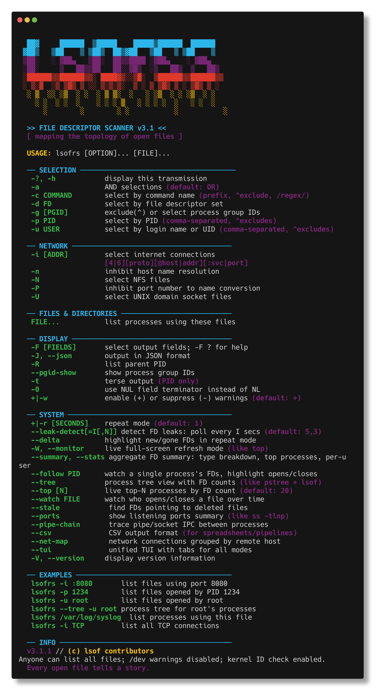

```
 ██▓      ██████  ▒█████    █████▒██████  ██████
▓██▒    ▒██    ▒ ▒██▒  ██▒▓██   ▒██   ▒ ▒██    ▒
▒██░    ░ ▓██▄   ▒██░  ██▒▒████ ░▓██▄    ░ ▓██▄
▒██░      ▒   ██▒▒██   ██░░▓█▒  ░▒   ██▒  ▒   ██▒
░██████▒▒██████▒▒░ ████▓▒░░▒█░  ▒██████▒▒██████▒▒
░ ▒░▓  ░▒ ▒▓▒ ▒ ░░ ▒░▒░▒░  ▒ ░ ▒ ▒▓▒ ▒ ░ ▒▓▒ ▒ ░
░ ░ ▒  ░░ ░▒  ░ ░  ░ ▒ ▒░  ░   ░ ░▒  ░ ░ ░▒  ░ ░
  ░ ░  ░ ░  ░    ░ ░ ░ ▒   ░ ░ ░ ░  ░   ░ ░  ░
    ░        ░        ░ ░           ░           ░
```

<p align="center">
  <a href="https://github.com/MenkeTechnologies/lsofrs/actions/workflows/ci.yml"></a>
  <a href="https://crates.io/crates/lsofrs"></a>
  <a href="https://crates.io/crates/lsofrs"></a>
  <a href="https://docs.rs/lsofrs"></a>
  <a href="https://github.com/MenkeTechnologies/lsofrs/blob/main/LICENSE"></a>
</p>

> *"Rewritten in Rust. Faster. Safer. The same cyberpunk soul."*

---

## // WHAT IS THIS

**lsofrs** — **L**ist **S**ystem **O**pen **F**iles in **R**u**s**t — v4.7.1

**`lsf`** is the shorter form of **`lsofrs`** (same binary; quicker to type).

A Rust rewrite of [lsofng](https://github.com/MenkeTechnologies/lsofng), the modernized lsof diagnostic tool. Maps the invisible topology between processes and the files they hold open: regular files, directories, sockets, pipes, devices, kqueues — anything the kernel touches.

If a process has a file descriptor, `lsofrs` sees it.

---



---

## // JACK IN — BUILD FROM SOURCE

```bash
cargo build --release
sudo cp target/release/lsf /usr/local/sbin/
```

The same build also emits `target/release/lsf` (shorter form of `lsofrs`; same binary). Copy that too if you want both on `PATH`.

Or install directly:

```bash
cargo install --path .
```

Install the man page:

```bash
sudo cp lsofrs.1 /usr/local/share/man/man1/
man lsofrs
```

---

## // USAGE

```bash
lsf                           # list all open files
lsf -p 1234                   # files for PID 1234
lsf -c Chrome                 # files for Chrome processes
lsf -u root                   # files for root user
lsf -i                        # network connections only
lsf -i :8080                  # who's listening on port 8080
lsf /path/to/file             # who has this file open
lsf -t -c nginx               # just PIDs (for scripting)
```

### Network Filters

```bash
lsf -i                        # all network files
lsf -i 4                      # IPv4 only
lsf -i 6                      # IPv6 only
lsf -i TCP                    # TCP only
lsf -i :443                   # port 443
lsf -i TCP:443                # TCP port 443
```

### Output Formats

```bash
lsf                           # columnar (default, cyberpunk-themed on TTY)
lsf --json                    # JSON array output
lsf -J                        # JSON (short form)
lsf -F pcfn                   # field output (p=pid, c=cmd, f=fd, n=name)
lsf -t                        # terse (PIDs only)
```

### Selection Combinators

```bash
lsf -p 1234,5678              # multiple PIDs
lsf -u root,wizard            # multiple users
lsf -p ^1234                  # exclude PID 1234
lsf -u ^root                  # exclude root
lsf -a -p 1234 -i             # AND: PID 1234 AND network
lsf -d 0-10                   # FD range 0-10
lsf -c '/nginx|apache/'       # regex command match
```

---

## // ADVANCED MODES

### Unified TUI (`--tui`)

Full-screen tabbed dashboard with all modes in one interface. 7 clickable tabs, 31 color themes, mouse support, hover/right-click tooltips, theme chooser + editor, config persistence.

```bash
lsf --tui                     # launch TUI (restores last tab/theme)
lsf --tui --theme matrix      # launch with Matrix theme
sudo lsf --tui                # full visibility (all processes)
```

**Tabs**: TOP | SUMMARY | PORTS | TREE | NET-MAP | PIPES | STALE — click or press Tab/1-7 to switch.

**Bottom bar**: `▶▶▶ LSOFRS ◀◀◀ │ procs:N │ files:N │ tcp:N udp:N unix:N pipe:N │ rate:Ns │ theme:Name │ paused:no │ h=help │ HH:MM:SS` — each `│` segment is a hover zone with verbose tooltips.

**Mouse**: click tabs, scroll rows, right-click for detailed tooltips (PID, FD breakdown, kill hints, copy hints), hover 1s for auto-tooltips.

**Theme chooser** (`c`): browse 31 themes with color swatches, live preview as you scroll, Enter to apply + save.

**Theme editor** (`C`): create custom 6-color palettes, adjust values 0-255, name and save to `~/.lsofrs.conf`.

### Top-N Dashboard (`--top`)

Live auto-refreshing dashboard of the top processes sorted by FD count. Like `iotop` for file descriptors — shows FD type distribution bars, delta tracking, and per-process breakdowns.

```bash
lsf --top                     # top 20 processes by FD count
lsf --top 10                  # top 10 only
lsf --top -r 5                # refresh every 5 seconds
lsf --top -u root             # top FD consumers for root
```

**Top-specific keys**: `s` cycle sort, `r` reverse, `+`/`-` show more/fewer, `b` toggle bar, `d` toggle delta. See [Interactive Controls](#-interactive-controls) for common keys.

### File Watch (`--watch FILE`)

Monitor who opens and closes a specific file over time. Prints timestamped `+OPEN`/`-CLOSE` events as they happen — like a lightweight `inotifywait` / `fs_usage` for a single path.

```bash
lsf --watch /var/log/syslog          # watch syslog
lsf --watch /tmp/myapp.sock          # watch a socket file
lsf --watch /dev/null -r 2           # poll every 2 seconds
```

Each event shows timestamp, open/close tag, PID, user, FD, and command. When piped, prints a single snapshot and exits.

### Stale FDs (`--stale`)

Find file descriptors pointing to deleted files — a common source of disk space leaks, zombie file handles, and security issues.

```bash
lsf --stale                   # find all deleted-file FDs
lsf --stale -u www-data       # deleted files held by www-data
lsf --stale --json            # JSON output
```

### Listening Ports (`--ports`)

Quick "what's listening where" summary — like `ss -tlnp` but cross-platform (macOS + Linux).

```bash
lsf --ports                   # show all listening TCP/UDP ports
lsf --ports --json            # JSON output
lsf --ports -u root           # ports opened by root only
```

### Pipe Chain (`--pipe-chain`)

Trace pipe and unix socket pairs between processes — visualize the IPC topology.

```bash
lsf --pipe-chain              # show all inter-process pipe/socket connections
lsf --pipe-chain --json       # JSON output
lsf --pipe-chain -c Chrome    # pipes within Chrome process tree
```

### Network Map (`--net-map`)

Group network connections by remote host — see which servers your system talks to and how many connections each has.

```bash
lsf --net-map                 # connections grouped by remote host
lsf --net-map --json          # JSON output
lsf --net-map -u wizard       # only wizard's connections
```

### CSV Export (`--csv`)

Pure CSV output for pipelines, spreadsheets, and data analysis. RFC 4180-compliant quoting.

```bash
lsf --csv                     # full CSV dump
lsf --csv -i TCP              # CSV of TCP connections only
lsf --csv -p 1234 > out.csv   # export PID 1234 to file
```

### Process Tree (`--tree`)

Hierarchical process tree view with FD counts, type breakdowns, and network connection counts. Like `pstree` meets `lsof`.

```bash
lsf --tree                    # full process tree with FD stats
lsf --tree -u root            # tree for root's processes
lsf --tree -c Chrome          # tree for Chrome and helpers
lsf --tree --json             # JSON tree with nested children
```

Each node shows: PID, user, FD count, command name, type breakdown (`[REG:12 IPv4:3 PIPE:2]`), and network connection count. Notable files (sockets, pipes) are listed inline under each process.

### Live Monitor (`--monitor` / `-W`)

Full-screen alternate-buffer display like `top(1)`. Auto-refreshes with interactive controls.

```bash
lsf --monitor                 # full-screen monitor
lsf -W -r 2                   # refresh every 2 seconds
lsf -W -c Chrome              # monitor Chrome only
```

**Controls**: `s`=sort, `r`=reverse, `f`=filter, `p`=pause, `?`=help, `q`=quit

### Follow Mode (`--follow PID`)

Watch a single process's FDs in real-time. New opens highlighted `+NEW` in green, closes `-DEL` in red.

```bash
lsf --follow 1234             # watch PID 1234
lsf --follow 1234 -r 2        # 2-second refresh
```

### FD Leak Detection (`--leak-detect`)

Monitors per-process FD counts over time. Flags processes with monotonically increasing FD counts.

```bash
lsf --leak-detect             # default: 5s interval, 3 increase threshold
lsf --leak-detect=10,5        # 10s interval, flag after 5 consecutive increases
lsf --leak-detect -u wizard   # monitor only wizard's processes
```

### Summary / Statistics (`--summary`)

Aggregate FD breakdown with bar charts, top processes, per-user totals. Add `-r N` for live auto-refreshing TUI mode.

```bash
lsf --summary                 # text report (single-shot)
lsf --summary -r 2            # live TUI, refresh every 2s
lsf --summary --json          # JSON report
lsf --summary -i              # network-only summary
```

### Delta Highlighting (`--delta`)

Color-code changes between repeat iterations. New FDs in green, gone in red.

```bash
lsf --delta -r 2              # repeat every 2s with change highlighting
lsf --delta -r 1 -c myapp     # watch myapp changes
```

---

## // CYBERPUNK THEME

When output goes to a TTY, lsofrs activates cyberpunk-themed column headers and ANSI coloring:

| Piped | TTY |
|-------|-----|
| COMMAND | PROCESS |
| PID | PRC |
| USER | H4XOR |
| TYPE | CL4SS |
| DEVICE | DEV/ICE |
| SIZE/OFF | BYT3/0FF |
| NODE | N0DE |
| NAME | T4RGET |

When piped or redirected, plain headers and no colors are used — safe for scripts.

---

## // INTERACTIVE CONTROLS

All live TUI modes (`--tui`, `--top`, `--summary -r`) share common keybindings.

**Common keys**:

| Key | Action |
|-----|--------|
| `1`-`9` | Set refresh interval (seconds) |
| `<`/`>` | Fine-adjust refresh interval (±1s) |
| `p` | Pause/resume data collection |
| `?`/`h` | Toggle help overlay |
| `c` | Open theme chooser (31 themes with swatches) |
| `C` | Open theme editor (custom 6-color palettes) |
| `T` | Toggle hover tooltips (right-click still works) |
| `x` | Toggle border |
| `t` | Toggle compact/expanded view |
| `o` | Freeze/unfreeze sort order |
| `/` | Filter popup (regex search) |
| `0` | Clear filter |
| `j`/`k`/`↑`/`↓` | Navigate rows |
| `F` | Pin/unpin selected row |
| `y` | Copy selected row to clipboard |
| `e` | Export current tab to file |
| `q`/`Esc`/`Ctrl-C` | Quit |

**`--tui` additional keys**:

| Key | Action |
|-----|--------|
| `Tab`/`→` | Next tab |
| `BackTab`/`←` | Previous tab |
| `1`-`7` | Jump to tab by number |
| Click tab | Switch to clicked tab |
| Right-click row | Verbose tooltip (PID, FDs, kill hints) |
| Hover 1s | Auto-tooltip (disappears on mouse move) |

**`--top` additional keys**:

| Key | Action |
|-----|--------|
| `s` | Cycle sort column (FDs→PID→USER→REG→SOCK→PIPE→OTHER→DELTA→CMD) |
| `r` | Reverse sort order |
| `+`/`-` | Show more/fewer processes (±5) |
| `b` | Toggle distribution bar column |
| `d` | Toggle delta column |

Non-TTY (piped) output always does a single-shot print and exits — no TUI, no key handling.

---

## // ARCHITECTURE

```
src/
├── main.rs      # CLI entry point, dispatch, repeat/leak-detect loops
├── cli.rs       # clap argument definitions + custom help display
├── types.rs     # Core data structures (Process, OpenFile, SocketInfo, etc.)
├── darwin.rs    # macOS libproc FFI — process/FD enumeration (rayon parallel)
├── linux.rs     # Linux /proc filesystem — process/FD enumeration (rayon parallel)
├── freebsd.rs   # FreeBSD sysctl + procfs — process/FD enumeration
├── filter.rs    # Selection & filtering (PID, user, command, FD, network)
├── output.rs    # Columnar & field output formatting, ANSI theming
├── json.rs      # JSON serialization via serde
├── monitor.rs   # Live full-screen mode (crossterm alternate screen)
├── follow.rs    # Single-process FD tracking with status transitions
├── leak.rs      # Circular-buffer leak detector
├── delta.rs     # Iteration-diff engine for change highlighting
├── summary.rs   # Aggregate statistics with bar charts
├── tree.rs      # Process tree view with FD inheritance
├── tui_app.rs   # Shared TUI framework (TuiMode trait, ratatui)
├── tui_tabs.rs  # Unified tabbed TUI (--tui) with 7 tabs, mouse, tooltips
├── theme.rs     # 31 color themes + custom theme support
├── config.rs    # TOML config persistence (~/.lsofrs.conf)
├── top.rs       # Live top-N FD dashboard (TuiMode)
├── watch.rs     # File watch — monitor opens/closes over time
├── stale.rs     # Stale FD finder — deleted files still held open
├── ports.rs     # Listening ports summary (like ss -tlnp)
├── pipe_chain.rs # Pipe/socket IPC topology between processes
├── csv_out.rs   # CSV export (RFC 4180)
└── net_map.rs   # Network connections grouped by remote host
lsofrs.1         # Man page (roff)
completions/
└── _lsofrs      # Zsh completion function
```

### Shell Completions

Zsh completions are provided in `completions/_lsofrs`. To install:

```bash
cp completions/_lsofrs /usr/local/share/zsh/site-functions/
# or symlink into your fpath
ln -sf "$PWD/completions/_lsofrs" /usr/local/share/zsh/site-functions/_lsofrs
# then reload
autoload -Uz compinit && compinit
```

### Platform Support

Supports **macOS/Darwin** (libproc FFI), **Linux** (`/proc` filesystem), and **FreeBSD** (sysctl + procfs). Platform modules are gated behind `#[cfg(target_os)]`. Process gathering is parallelized with rayon.


### Key Design Decisions

- **Zero-copy FFI**: Raw `repr(C)` structs matched to Darwin kernel headers. No intermediate parsing.
- **Parallel gathering**: Per-PID FD enumeration parallelized with rayon.
- **Streaming output**: Processes are gathered, filtered, and printed in a single pass.
- **Shared TUI framework**: `TuiMode` trait — all live modes get common keybindings, alternate screen, and atomic frame rendering.
- **serde for JSON**: Derive-based serialization, no hand-rolled escaping.
- **clap for CLI**: Derive-based argument parsing with full help generation.

---

## // PERFORMANCE

Benchmarked on macOS with `hyperfine` (10 runs, 3 warmup, ~900 processes / ~8000 open files, rayon parallel gathering):

### All Open Files (default)

| Tool | Mean | Min–Max | Speedup |
|------|------|---------|---------|
| **lsofrs** (Rust) | **58 ms** | 40–111 ms | — |
| lsof 4.91 (C) | 5,555 ms | 5,194–8,343 ms | **95x** slower |
| lsofng (C) | 13,202 ms | 11,299–16,336 ms | **226x** slower |

### Network Connections (`-i TCP`)

| Tool | Mean | Min–Max | Speedup |
|------|------|---------|---------|
| **lsofrs** | **9 ms** | 9–10 ms | — |
| lsof 4.91 | 5,117 ms | 5,098–5,229 ms | **555x** slower |
| lsofng | 10,520 ms | 10,097–13,792 ms | **1,141x** slower |

### Terse Output (`-t`, PIDs only)

| Tool | Mean | Min–Max | Speedup |
|------|------|---------|---------|
| **lsofrs** | **14 ms** | 12–16 ms | — |
| lsofng | 149 ms | 133–216 ms | **10x** slower |
| lsof 4.91 | 273 ms | 249–298 ms | **19x** slower |

### Structured Output (`-J` JSON / `-F` field)

| Tool | Mean | Min–Max | Speedup |
|------|------|---------|---------|
| **lsofrs** `-J` | **41 ms** | 40–42 ms | — |
| lsofng `-J` | 164 ms | 142–336 ms | **4x** slower |
| lsof `-F pcfn` | 5,552 ms | 5,171–7,391 ms | **134x** slower |

The rayon-parallelized per-PID FD enumeration combined with zero-copy FFI structs gives lsofrs a **95–1,141x** advantage over traditional lsof implementations.

---

## // LICENSE

MIT License — Jacob Menke

---

## // CREDITS

Rust rewrite of [lsofng](https://github.com/MenkeTechnologies/lsofng) by Jacob Menke, which itself is a modernized fork of the original [lsof](https://github.com/lsof-org/lsof) by Vic Abell.
